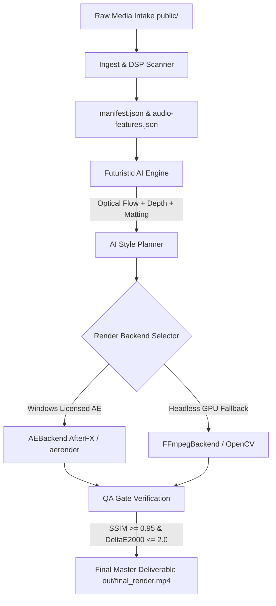

# 🎬 Antigravity AI Video Engine — Master Hub

> [!abstract] Executive Summary
> The **Antigravity AI Video Engine** is an enterprise-grade, hybrid video compositing and rendering system. It pairs **React / Remotion 4.0** with **Adobe After Effects 2025 Headless Automation (ExtendScript)**, driven by **SHA-256 Idempotent DAG Pipeline**, **Offline DSP Audio/Subtitle Ingestion**, **Dual-Engine Cubic Bézier Motion Parity**, and **Futuristic AI Modules (Optical Flow, Depth Maps, SAM 2 Matting)**.

---

## ⚡ Quick Control & Access Panel

> [!rocket] 1-Click Launch Web Dashboard
> ```bash
> python server.py
> ```
> 🌐 **Interactive Web UI**: [http://localhost:8000](http://localhost:8000)

| Command | Purpose | Output Location |
|---|---|---|
| `python server.py` | 🌐 Launch 1-Click Web Dashboard UI | `http://localhost:8000` |
| `npm run ingest` | 📡 Run Offline DSP & Asset Manifest Scanner | `src/generated/manifest.json` |
| `python run_sss_pipeline.py` | ⚙️ Run Master SSS++ Fault-Tolerant DAG | `out/final_render.mp4` |
| `npm run render:remotion` | 🎨 Render via Remotion React WebGL | `out/final_render.mp4` |
| `npm run render:ae` | 🔮 Render via Adobe After Effects 2025 CLI | `out/final_render_ae.mp4` |
| `npm run typecheck` | 🛡️ Run 100% Strict TypeScript Verification | Console Output |

---

## 🔄 End-to-End DAG System Flow



---

## 🛠️ Subsystems Architecture

> [!info] 1. Offline DSP Ingestion Pipeline (`scripts/`)
> - **Asset Discovery & 4K Proxy Generator** (`scripts/discover-assets.mjs`): Scans media files, extracts stream resolution/FPS metadata, and automatically creates lightweight 720p/30fps proxies for 4K footage.
> - **Multi-Band Audio Spectral Flux** (`scripts/analyze-audio.mjs`): Performs spectral decomposition extracting Sub/Kick (20–150Hz), Snare (150–4000Hz), and peak transients.
> - **Forced Alignment Subtitles** (`scripts/extract-subtitles.mjs`): Extracts word timestamps, confidence metrics, and emphasis scores for dynamic karaoke captioning.
> - **Zod Runtime Schemas** (`src/schemas/`): Validates manifest, audio features, and subtitles data streams with strict type safety.

> [!tip] 2. Dual-Engine Cubic Bézier Motion Parity (`src/utils/motion.ts` & `scripts/ae_helpers/bezier.jsx`)
> Ensures mathematical motion parity between web previews and After Effects renders:
> - **Remotion Bezier Easing**: Converts 4-point vectors `[x1, y1, x2, y2]` via `bezier-easing`.
> - **ExtendScript KeyframeEase Translation**: Converts coordinate vectors directly into native After Effects `KeyframeEase` influence and velocity handles.

> [!note] 3. Unified Master After Effects Engine (`build_ae_master.jsx` & `ae_presets/`)
> - Dynamic configuration driver using `$.fileName` for portable, OS-agnostic relative paths.
> - Imports `manifest.json`, `audio-features.json`, and preset drivers (`masterpiece.json`, `phonk.json`, `hypnotic.json`, `cyberpunk.json`, `vhs_retro.json`, `minimalist.json`).
> - Writes structured error logs to `out/logs/ae_build_<timestamp>.json`.

> [!example] 4. Remotion React VFX & Shader Stack (`src/components/`)
> - `BeatSyncedCamera.tsx`: 3D spatial perspective shifts driven by audio kick/snare spectral flux.
> - `WebGLShaderPass.tsx` & `GlowShaderPass.tsx`: Procedural chromatic aberration, film grain noise, and neon bloom aura.
> - `CaptionsLayer.tsx`: Animated karaoke subtitles featuring glowing stroke text and spring entrance scaling.
> - `AnimatedLowerThird.tsx`: Broadcast lower-third overlay with glassmorphism styling.

---

## 🎨 Creative Preset Driver Library

> [!success] Built-in Aesthetic Presets (`ae_presets/`)
> - 🌟 **`masterpiece.json`**: 60 FPS ultra-grade VFX edit with full color balance and heavy glow aura.
> - ⚡ **`phonk.json`**: 60 FPS rapid beat transitions with high contrast and aggressive transient flashes.
> - 🌀 **`hypnotic.json`**: Parabolic velocity curves for non-linear speed ramps.
> - 🌆 **`cyberpunk.json`**: High contrast neon cyan/purple tint with anamorphic light leaks.
> - 📼 **`vhs_retro.json`**: Analog warm glow and retro 30 FPS timing.
> - 📐 **`minimalist.json`**: Clean broadcast framing with zero distractive glow.

---

## 📁 Repository Quick Map (`C:\Users\ADMIN\OneDrive\Desktop\ae`)

> [!quote] Workspace Files
> - 📜 `README.md` — Master CLI & UI setup guide
> - 📜 `WHAT_WE_DID.txt` — Build summary documentation
> - 📜 `full.txt` — Deep-dive technical specification
> - 📜 `BEST_PROMPT.txt` & `PROMPT_HIGH_END_IMPROVEMENT.txt` — Master AI system prompts
> - 📜 `SSS_MASTER_ARCHITECTURE.md` — Enterprise architecture reference
> - 📜 `server.py` — Local HTTP server with automatic render cleanup
> - 📜 `web/index.html` — Cyberpunk dark-mode web dashboard UI
